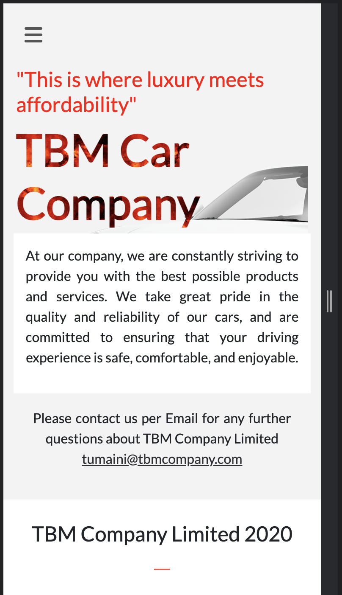

    
   

  <h3><b>TUMAINI BARNABAS MAGANIKO</b></h3>

<!-- TABLE OF CONTENTS -->

# 📗 Table of Contents

- [📗 Table of Contents](#-table-of-contents)
- [📖 TBM CAR Company ](#-tbm-car-company-)
  - [🛠 Screenshot](#-screenshot)
    - [Desktop Home Page](#desktop-home-page)
    - [Mobile Home page](#mobile-home-page)
    - [Desktop About Page](#desktop-about-page)
  - [🛠 Built With ](#-built-with-)
    - [Tech Stack ](#tech-stack-)
  - [🚀 Live Demo ](#-live-demo-)
  - [🚀 Video about the project ](#-video-about-the-project-)
  - [💻 Getting Started ](#-getting-started-)
    - [Prerequisites](#prerequisites)
    - [Setup](#setup)
    - [Usage](#usage)
    - [Run tests](#run-tests)
    - [Deployment](#deployment)
  - [👥 Author ](#-author-)
  - [🤝 Contributing ](#-contributing-)
  - [⭐️ Show your support ](#️-show-your-support-)
  - [🙏 Acknowledgments ](#-acknowledgments-)
  - [📝 License ](#-license-)

<!-- PROJECT DESCRIPTION -->

# 📖 TBM CAR Company 

>Welcome to TBM CAR COMPANY, The mission of this company is to provide high-quality vehicles to their valued customers while delivering exceptional customer service.
## 🛠 Screenshot 
### Desktop Home Page

### Mobile Home page

### Desktop About Page

## 🛠 Built With 
1. HTML
2. CSS
3. JAVASCRIPT
4. BOOTSTRAP

### Tech Stack 

  
Client

  <ul>
    <li><a href="/index.html">HTML</a></li>
    <li><a href="/styles.css">CSS</a></li>
    <li><a href="/index.js">JAVASCRIPT</a></li>
  </ul>

(<a href="#readme-top">back to top</a>)

<!-- LIVE DEMO -->

## 🚀 Live Demo 

- [Live Demo Link](https://tumainimaganiko.github.io/Vehicle-Company/)

(<a href="#readme-top">back to top</a>)

## 🚀 Video about the project 
- [Video Link](https://www.loom.com/share/66a96ad690c840eab382c862335c4156)
<!-- GETTING STARTED -->

## 💻 Getting Started 

To get a local copy up and running, follow these steps.

### Prerequisites

1. Web browser
2. Code editor
3. Git-smc

### Setup

To get a local copy up and running follow these simple example steps.

- git clone https://github.com/tumainimaganiko/Vehicle-Company
- cd To-Do-Lists
- npm install

### Usage

To run the project, execute the following command:

Open index.html using live server extension.

### Run tests

Coming soon

### Deployment

Coming soon

(<a href="#readme-top">back to top</a>)

<!-- AUTHORS -->

## 👥 Author 

👤 Tumaini Maganiko

- GitHub: [@githubhandle](https://github.com/tumainimaganiko)
- Twitter: [@twitterhandle](https://twitter.com/Chief2maini)
- LinkedIn: [LinkedIn](https://www.linkedin.com/in/tumaini-maganiko-991b30262/)

-Summarized video of my project: [loom](https://www.loom.com/share/1ea2df078c4940e39b408606dbbd1cbf)

(<a href="#readme-top">back to top</a>)

<!-- CONTRIBUTING -->

## 🤝 Contributing 

Contributions, issues, and feature requests are welcome!
1. Fork the Project
2. Create your Feature Branch (`git checkout -b 'branchname'`)
3. Commit your Changes (`git commit -m 'Add some branchname'`)
4. Push to the Branch (`git push origin branchname`)
5. Open a Pull Request

Feel free to check the [issues page](../../issues/).

(<a href="#readme-top">back to top</a>)

<!-- SUPPORT -->

## ⭐️ Show your support 

If you like this project rate me star 

(<a href="#readme-top">back to top</a>)

<!-- ACKNOWLEDGEMENTS -->

## 🙏 Acknowledgments 
1. Microverse
2. Cindy Shin - Original design by (Cindy Shin in Behance) [https://www.behance.net/gallery/29845175/CC-Global-Summit-2015].

(<a href="#readme-top">back to top</a>)

<!-- LICENSE -->

## 📝 License 

This project is [MIT](./LICENSE) licensed.

(<a href="#readme-top">back to top</a>)
